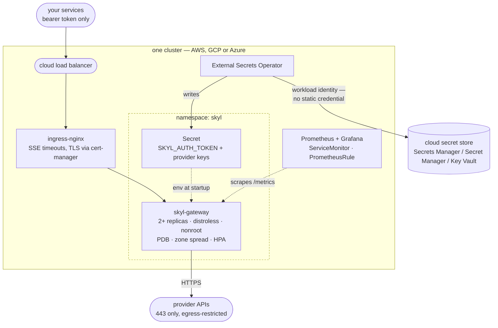
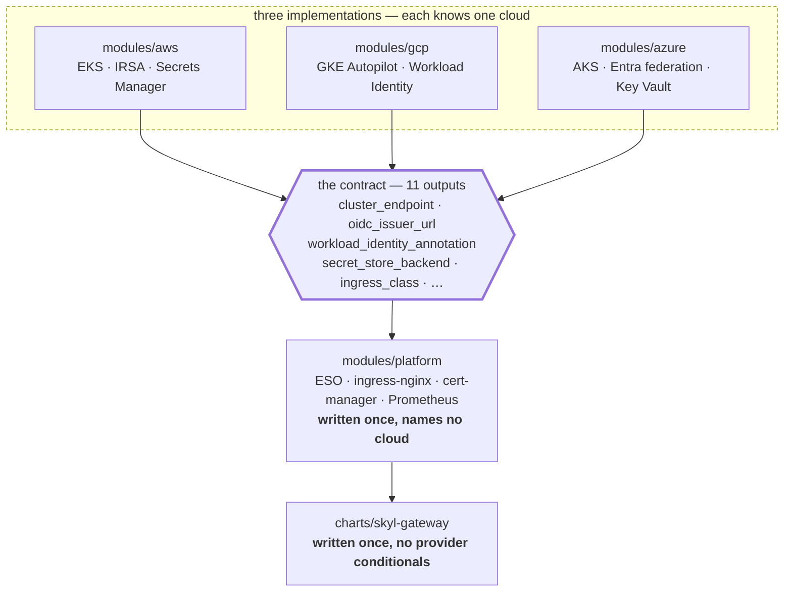
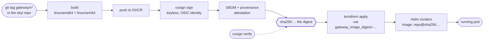

# skyl_infrastructure

[](https://pkg.go.dev/github.com/BAGOMBEKA-JOB-DEV/skyl/gateway)

Deployment infrastructure for
[skyl-gateway](https://github.com/BAGOMBEKA-JOB-DEV/skyl) — Terraform that
stands up a Kubernetes cluster on **AWS, GCP or Azure**, one Helm chart that
runs identically on all three, and CI that will not let a bad manifest through.

The gateway is one authenticated endpoint that fans out to Anthropic, OpenAI,
Gemini and any OpenAI-compatible provider. It holds the API keys so your
services do not have to.

## What this builds



Two things that diagram is trying to make obvious. Provider credentials never
pass through git or Terraform state — they go from the cloud's own secret store
into the pod, and External Secrets reaches that store with a workload identity
rather than a stored key. And egress is restricted to 443 with the cloud
metadata endpoint blocked, because a pod holding those keys is the ideal place
to exfiltrate them from
([ADR-0004](docs/adr/0004-egress-restriction.md)).

## What is here

```
terraform/
  modules/{aws,gcp,azure}/   one cluster each, identical output contract
  modules/platform/          add-ons + the gateway, written once
  environments/dev/{aws,gcp,azure}/
charts/skyl-gateway/         the chart
policy/                      Conftest rules the chart must satisfy
docs/                        runbook, ADRs, cost
```

## How three clouds stay one codebase

Every cloud module emits the **same eleven outputs** —
[`terraform/modules/CONTRACT.md`](terraform/modules/CONTRACT.md). Everything
above them consumes only those, so `modules/platform` and
`charts/skyl-gateway` contain no provider conditionals at all.



Everything below the thick line is written once. Adding a fourth cloud means
writing one module against the contract and changing nothing above it.

Both halves of that claim are enforced mechanically rather than by review: CI
greps each cloud module for all eleven output names, and fails if
`modules/platform` mentions a cloud anywhere outside the single sanctioned
exception. `terraform validate` would not catch either — a dropped output only
surfaces at the first environment that consumes it.

The `module "platform"` block is byte-identical in all three environments. Diff
them:

```bash
diff terraform/environments/dev/{gcp,aws}/main.tf   # only the cluster + providers differ
```

CI enforces both halves: a job greps every cloud module for the required
outputs, and another fails if `modules/platform` mentions a cloud outside the
one place a difference is unavoidable (the External Secrets provider block).

Cross-cloud primitives:

| Concern | Chosen | Why |
|---|---|---|
| Secrets | External Secrets Operator | One CRD over Secrets Manager, Secret Manager and Key Vault. Nothing secret in git or in state |
| Identity | IRSA / Workload Identity / Entra federation | No static cloud credentials anywhere, including CI |
| Ingress | ingress-nginx + cert-manager | Behaves the same on all three. See [ADR-0002](docs/adr/0002-ingress-nginx-over-gateway-api.md) |
| Observability | kube-prometheus-stack | skyl already exports OpenTelemetry GenAI metrics |

## Where the image comes from

The chart refuses to deploy a mutable tag, which makes the path from source to
running pod worth drawing:



A tag is a mutable pointer: the same `helm upgrade` run twice can deploy
different bytes, which makes a rollback a guess and means the signature covers
something nobody recorded. Pinning the digest is what makes "roll back to what
was running yesterday" a fact rather than a hope — and the chart `fail`s at
render time rather than deploying a tag.

The current release is **v1.0.0**, published 2026-09-06:

```
ghcr.io/bagombeka-job-dev/skyl-gateway@sha256:6f00bc8f4861cc49a085a9b336264124e2b6bfffd2d3fe8d9e1a57c6cb3f6f6b
```

Multi-architecture (amd64 + arm64), cosign-signed, with an SBOM and a
build-provenance attestation. That digest is what the dev environments pin.

## Getting started

You need a published image digest. skyl's `publish-image` workflow prints one
on every `gateway/v*` tag; the chart refuses to deploy a mutable tag.

```bash
cd terraform/environments/dev/gcp

terraform init -backend-config="bucket=<your-state-bucket>"
terraform apply \
  -var project_id=<your-project> \
  -var gateway_image_digest=sha256:<digest>
```

Then populate the secrets — Terraform creates the containers but never the
values, because a value in Terraform is a value in state:

```bash
echo -n "$(openssl rand -hex 32)" | \
  gcloud secrets versions add skyl-gateway-auth-token --data-file=-
echo -n "$ANTHROPIC_API_KEY" | \
  gcloud secrets versions add skyl-anthropic-api-key --data-file=-
```

`terraform output smoke_test` prints the commands to verify it.

AWS and Azure are the same three steps against
`environments/dev/{aws,azure}`. Costs differ substantially —
[docs/cost.md](docs/cost.md) has real numbers.

## Working on the chart

```bash
helm lint charts/skyl-gateway --set image.digest=sha256:$(printf '0%.0s' {1..64})
helm template gw charts/skyl-gateway --set image.digest=sha256:0000... | \
  kubeconform -strict -schema-location default \
    -schema-location 'https://raw.githubusercontent.com/datreeio/CRDs-catalog/main/{{.Group}}/{{.ResourceKind}}_{{.ResourceAPIVersion}}.json'
conftest test --policy policy rendered.yaml
```

`policy/fixtures/violations.yaml` is a deliberately broken manifest. CI asserts
that conftest **rejects** it — a policy suite that cannot fail is not a policy
suite, and that failure is otherwise silent.

## Things that will bite you

Each of these is encoded in the chart, and most are also a policy rule. They
come from skyl's own runbook, verified against a running binary.

- **`/healthz` stays 200 while draining. `/readyz` goes 503.** Liveness must
  point at `/healthz`. Point it at `/readyz` and the kubelet restarts the pod
  during every graceful shutdown.
- **Shutdown takes up to ~32s**, so `terminationGracePeriodSeconds` is 40.
  Lower it and live SSE streams are truncated — streams the provider has
  already billed you for.
- **The image has no shell.** Every probe is `httpGet`; an `exec` probe fails
  as "no such file or directory" and reads like a crash.
- **Starting with no provider key is fatal.** An unsynced ExternalSecret
  presents as CrashLoopBackOff. Check the ExternalSecret before the image.
- **The grace-expiry warning exits 0.** A pod that force-closed streams logs a
  WARN and exits cleanly, so restart-count alerting will never see it.

## The three repositories

| Repository | What it is |
|---|---|
| [skyl](https://github.com/BAGOMBEKA-JOB-DEV/skyl) | The Go library, the adapters, and the gateway this deploys |
| [skyl_docs](https://github.com/BAGOMBEKA-JOB-DEV/skyl_docs) | The [documentation site](https://skyl-docs.vercel.app/) (Next.js) |
| **[skyl_infrastructure](https://github.com/BAGOMBEKA-JOB-DEV/skyl_infrastructure)** | This one — Terraform for three clouds, the Helm chart, CI |

The probe semantics, the 32-second drain and the exit-code behaviour encoded in
this chart are all documented at source in
[skyl's gateway runbook](https://github.com/BAGOMBEKA-JOB-DEV/skyl/blob/main/docs/gateway.md#runbook).
When the two disagree, that one is right and this is the bug.

## Contributing

See [CONTRIBUTING.md](CONTRIBUTING.md). Commits need a `Signed-off-by` line
(`git commit -s`); CI enforces it. Apache-2.0, matching skyl.
