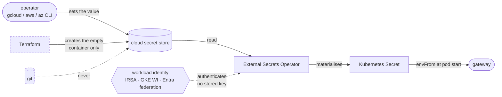

# ADR-0003: External Secrets Operator, with no secret values in Terraform

**Status:** accepted
**Date:** 2026-08-08

## Context

The gateway holds provider API keys and a bearer token. Every one is a live
credential against a paid API, so a leak is a direct bill as well as a
disclosure.

Options considered:

**Secrets in Terraform.** Simplest, and disqualifying: a value passed to a
Terraform resource is written to state in plaintext. State is the one file that
gets copied to laptops, attached to tickets and restored from backups. Marking
the variable `sensitive` hides it from *output*, not from state.

**Sealed Secrets.** Encrypted values committed to git, decrypted in-cluster.
Works, but the ciphertext is bound to one cluster's key, so it does not survive
a rebuild and cannot be shared across three clouds. Rotation means re-sealing
and committing.

**SOPS + age.** Better ergonomics, same fundamental shape — the secret is still
in git, and its safety rests on a key that must itself live somewhere.

**External Secrets Operator.** The value lives only in the cloud's secret store.
The cluster holds a reference.

## Decision

External Secrets Operator, and **Terraform creates secret containers but never
their values.**

```hcl
resource "google_secret_manager_secret" "gateway" {
  secret_id = each.value      # the container
  # no value — deliberately
}
```

Values are set out of band:

```bash
echo -n "$TOKEN" | gcloud secrets versions add skyl-gateway-auth-token --data-file=-
```

The resulting path, with the two places a secret is deliberately *absent*
marked:



The two dashed edges are the argument. Terraform touches the container but never
the value, because a value passed to a resource is written to state in
plaintext — and state is the one file that gets copied to laptops, attached to
tickets, and restored from backups. Git never sees it at all, which is what
rules out the sealed-secrets and SOPS options above.

Azure is the awkward case: `azurerm_key_vault_secret` requires a value, so a
placeholder is written with `lifecycle { ignore_changes = [value] }`. Without
that, every plan after the real secret is set shows a diff reverting it — and
eventually somebody applies it.

Authentication is workload identity on all three (IRSA, GKE Workload Identity,
Entra federated credentials). No static cloud credential exists anywhere,
including in CI.

## Consequences

One CRD covers all three clouds, so `charts/skyl-gateway` has one code path.
Nothing secret is in git or in state. Rotation happens in the cloud console or
CLI with no deploy.

A first apply produces a cluster whose pods CrashLoopBackOff until the secrets
are populated — because the gateway treats "no provider key" as fatal rather
than degrading. This looks alarming and is correct; the runbook names it as the
first thing to check.

ESO is another operator to run, and the blast radius of compromising it is every
secret its IAM binding allows. Hence the scoping: `skyl-*` name prefixes on AWS,
`secretAccessor` rather than admin on GCP, `Key Vault Secrets User` rather than
`Officer` on Azure.

The gateway reads its environment once at startup, so a refreshed Secret does
not reach a running pod. This is intentional — swapping a credential mid-flight
would fail in-progress requests. Zero-downtime rotation uses
`SKYL_AUTH_TOKENS`, which accepts several labelled tokens at once; see the
[runbook](../runbook.md#rotate-the-gateway-token-without-downtime).
